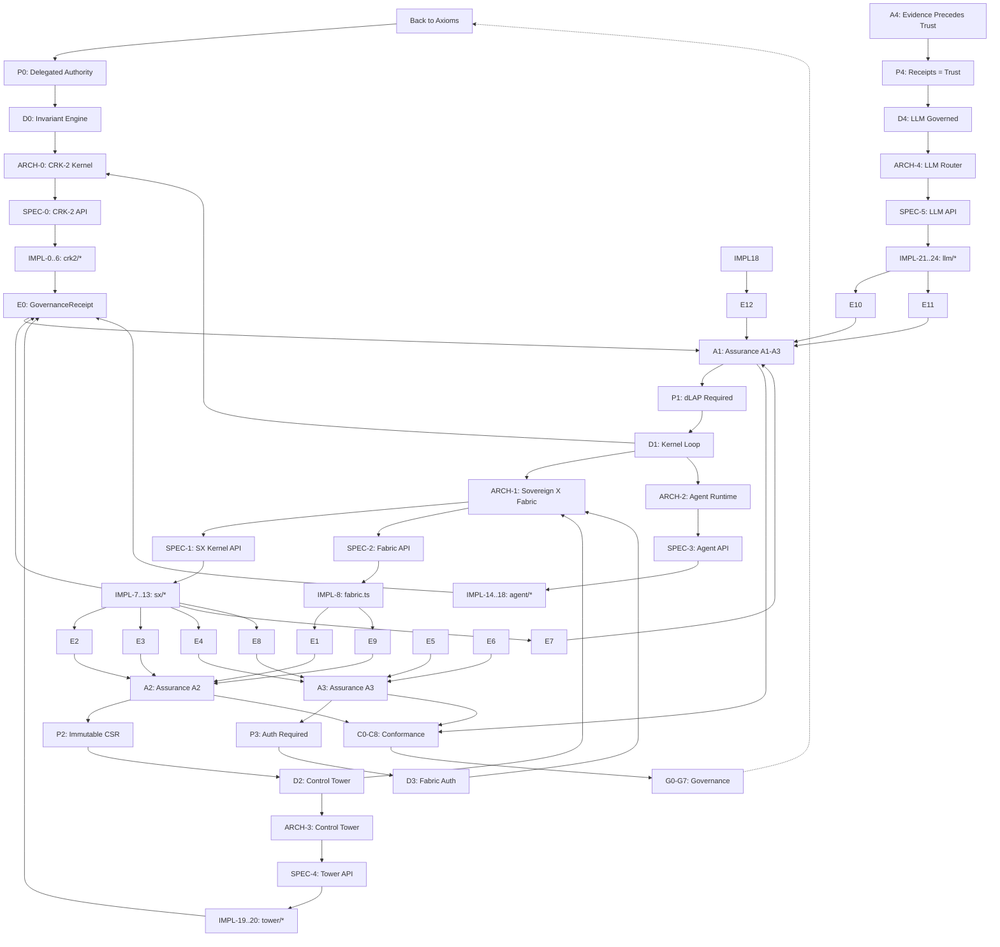

# CRA Graph: Constitutional Reasoning Architecture Mapping

Every component in this repository maps to **two dependency DAGs**:

```
JUSTIFICATION DAG (top-down authority):
Axioms → Principles → Doctrines → Architecture → Specs → Implementations

EVIDENCE DAG (bottom-up proof):
Implementations → Evidence → Assurance → Conformance → Governance
```

---

## 1. JUSTIFICATION DAG: Where Each Component Sits

### Layer 0: AXIOMS (Irreducible Constitutional Truths)
```
A0  User Sovereignty Overrides All Agent Decisions
A1  No Execution Without Constitutional Justification
A2  All State Transitions Must Be Auditable
A3  Compute Is A Governed Resource
A4  Evidence Precedes Trust
```

### Layer 1: PRINCIPLES (Derived from Axioms)
```
P0  Agent Authority Is Delegated, Not Inherent          ← from A0
P1  Every Action Requires dLAP Legality Check           ← from A1
P2  All Transitions Logged in Immutable CSR             ← from A2
P3  Hardware Routing Requires Constitutional Authorization ← from A3
P4  Receipts Are The Currency Of Trust                  ← from A4
```

### Layer 2: DOCTRINES (Operational Rules)
```
D0  Invariant Engine Enforces P1 At Runtime
D1  Kernel Governance Loop: validate → execute → receipt → ledger
D2  Control Tower Coordinates Multi-Agent Constitutional State
D3  Fabric Nodes Register Under Sovereign Authority
D4  Hardware Router Emits ComputeAuthorization Receipts
D5  LLM Selection Is A Governed Decision With Receipts
```

### Layer 3: ARCHITECTURE (System Structure)
```
ARCH-0  Constitutional Runtime Kernel (CRK-2)
  ├─ dLAP Engine          → D0
  ├─ Invariant Engine     → D0
  ├─ Constraint Engine    → D1
  ├─ PIT Engine           → D1
  ├─ Continuity Substrate → P2
  ├─ Ledger v2            → P2, P4
  └─ Cluster View (MACC)  → D2

ARCH-1  Sovereign X Fabric
  ├─ Kernel (Intent/Evidence/Arbitration) → D1, D2
  ├─ Fabric (Nodes/Tasks/Prongs)          → D3, D4
  ├─ Accounting (Budgets/Consumption)     → D3
  ├─ Worlds/Treaties (Federation)         → D2
  └─ IGEM/FTSS/QIGEM (Crypto/Trust)       → P4

ARCH-2  Agent Runtime
  ├─ AgentRuntime (Governed Loop)         → D1
  ├─ Core Agent (Plan/Generate/Verify)    → D1
  └─ Completion Engine (LLM)              → D5

ARCH-3  Control Tower
  ├─ Agent Registry           → D2
  ├─ Consensus Engine         → D2
  ├─ Drift Detector           → D2
  └─ Cluster Replay           → P2

ARCH-4  LLM Router
  ├─ Task Profiles (12 types) → D5
  ├─ Hardware Router          → D4
  ├─ Provider Registry        → D5
  └─ Model Selector           → D5
```

### Layer 4: SPECS (Formal Interfaces)
```
SPEC-0  CRK-2 Kernel API
  ├─ dLAP(action, context) → DLAPResult
  ├─ invariantEngine.checkAll(action, context) → {ok, invariantId}
  ├─ constraintEngine.check(action, context, cluster) → ConstraintCheckResult
  ├─ pitEngine.getBand/apply(context) → PITBand
  ├─ takeSnapshot/replay/list → Snapshot
  ├─ appendReceipt/list → ReceiptV2
  └─ clusterView() → ClusterState

SPEC-1  Sovereign X Kernel API
  ├─ createIntent/transition/enforceILC → IntentLifecycle
  ├─ submitEvidence/verify → EvidencePortal
  ├─ registerBoundary/check → GovernanceBoundary
  ├─ arbitrate/resolve → ArbitrationRecord
  ├─ authorizeCompute → ComputeAuthorization
  ├─ kernelGovernAction → {approved, receipt, reason}
  └─ getConstitutionalStatus/status/csr/verify

SPEC-2  Fabric API
  ├─ registerNode/get/list/updateHeartbeat/suspend → FabricNode
  ├─ executeFabricTask/complete/fail/revert → FabricTask
  ├─ completeProng/failProng → VielthornProng
  ├─ getFabricStatus → {nodes, tasks, prongs, integrity}

SPEC-3  Agent Runtime API
  ├─ validate(action) → ValidationResult
  ├─ receipt(action, invariants, options) → GovernanceReceipt
  ├─ generateCode/plan/refactor/verify/explain/applyPatch → Results
  └─ ledger: {append, list, tailHash}

SPEC-4  Control Tower API
  ├─ getClusterState → {agents, constitutional}
  ├─ ensureDefaultAgents
  └─ agentRegistry: register/list/get/updateStatus

SPEC-5  LLM Router API
  ├─ selectModel(task, options) → LLMConfig
  ├─ listTaskProfiles → TaskProfile[]
  ├─ getHardwareRecommendation → string
  ├─ formatTaskTable → string
  ├─ probeHardware → HardwareProfile
  ├─ suggestLLMBackend → string
  └─ providerRegistry: register/get/list/has
```

### Layer 5: IMPLEMENTATIONS (Code)
```
IMPL-0  crk2/kernel/dlap.ts              → SPEC-0.dLAP
IMPL-1  crk2/invariants/engine.ts        → SPEC-0.invariantEngine
IMPL-2  crk2/kernel/constraint-engine.ts → SPEC-0.constraintEngine
IMPL-3  crk2/kernel/pit-engine.ts        → SPEC-0.pitEngine
IMPL-4  crk2/continuity/substrate.ts     → SPEC-0.continuity
IMPL-5  crk2/ledger/ledger-v2.ts         → SPEC-0.ledger
IMPL-6  crk2/cluster/macc.ts             → SPEC-0.clusterView

IMPL-7  agent/sovereign-x/kernel.ts      → SPEC-1 (full)
IMPL-8  agent/sovereign-x/fabric.ts      → SPEC-2
IMPL-9  agent/sovereign-x/accounting.ts  → SPEC-1.accounting
IMPL-10 agent/sovereign-x/worlds.ts      → SPEC-1.worlds
IMPL-11 agent/sovereign-x/igem.ts        → SPEC-1.igem
IMPL-12 agent/sovereign-x/ftss.ts        → SPEC-1.ftss
IMPL-13 agent/sovereign-x/qigem.ts       → SPEC-1.qigem

IMPL-14 agent/runtime/agent-runtime.ts   → SPEC-3
IMPL-15 agent/core/agent.ts              → SPEC-3 (operations)
IMPL-16 agent/core/planner.ts            → SPEC-3.plan
IMPL-17 agent/core/executor.ts           → SPEC-3.execute
IMPL-18 agent/completion/engine.ts       → SPEC-3.completion

IMPL-19 control-tower/orchestrator/*.ts  → SPEC-4
IMPL-20 control-tower/drift/*.ts         → SPEC-4.drift

IMPL-21 src/model/router.ts              → SPEC-5
IMPL-22 src/runtime/hardwareRouter.ts    → SPEC-5.hardware
IMPL-23 src/providers/*-provider.ts      → SPEC-5.providerRegistry
IMPL-24 src/services/completion.ts       → SPEC-5.completion

IMPL-25 cockpit/src/panels/*             → UI for all SPECs
IMPL-26 backend/server.ts                → HTTP gateway for SPEC-0,1,3,4,5
```

---

## 2. EVIDENCE DAG: How Each Component Produces Proof

```
EVIDENCE PRIMITIVES (produced by implementations):
┌─────────────────────────────────────────────────────────────────────┐
│  E0  GovernanceReceipt          ← SPEC-3.receipt, SPEC-1.kernelGovernAction    │
│  E1  ComputeAuthorization       ← SPEC-2.authorizeCompute                       │
│  E2  IntentLifecycle            ← SPEC-1.createIntent/transition                 │
│  E3  EvidencePortal             ← SPEC-1.submitEvidence/verify                   │
│  E4  ConstitutionalStateRecord  ← SPEC-1.recordCSR (CSR ledger)                 │
│  E5  Snapshot                   ← SPEC-0.takeSnapshot, SPEC-3.updateContinuity   │
│  E6  LedgerEntry (ReceiptV2)    ← SPEC-0.appendReceipt                           │
│  E7  DriftReport                ← SPEC-1.detectConstitutionalDrift               │
│  E8  LineageCertificate         ← SPEC-1.issueLineageCertificate                 │
│  E9  FabricTask/Prong           ← SPEC-2.executeFabricTask                       │
│  E10 ModelSelectionReceipt      ← SPEC-5.selectModel (new)                       │
│  E11 HardwareProfile            ← SPEC-5.probeHardware                           │
│  E12 CompletionOutput           ← SPEC-5.runCompletion                           │
└─────────────────────────────────────────────────────────────────────┘
```

### Assurance Mapping (Evidence → Assurance Level)

| Evidence | Assurance Level | What It Proves |
|----------|----------------|----------------|
| E0 GovernanceReceipt | A1–A3 | Action validated, invariants checked, ledger appended |
| E1 ComputeAuthorization | A2 | Hardware routing constitutionally approved |
| E2 IntentLifecycle | A2 | Intent progressed through ILC with evidence |
| E3 EvidencePortal | A2 | Claim submitted + independently verified |
| E4 CSR Record | A3 | Immutable state transition with lineage |
| E5 Snapshot | A3 | Replayable system state at point-in-time |
| E6 LedgerEntry | A3 | Hash-chained audit trail |
| E7 DriftReport | A1 | Constitutional integrity check |
| E8 LineageCertificate | A3 | Full causal chain from genesis |
| E9 FabricTask | A2 | Distributed execution with provenance |
| E10 ModelSelectionReceipt | A1 | LLM choice governed, hardware-aware |
| E11 HardwareProfile | A1 | Platform capabilities attested |
| E12 CompletionOutput | A1 | LLM output with governance metadata |

### Conformance Mapping (Assurance → Conformance)

```
CONFORMANCE TARGETS:
┌────────────────────────────────────────────────────────────────────┐
│  C0  CRK-2 Conformance Suite     ← validates SPEC-0 implementations   │
│  C1  Sovereign X Kernel Tests    ← validates SPEC-1 implementations   │
│  C2  Fabric Integration Tests    ← validates SPEC-2 implementations   │
│  C3  Agent Runtime Tests         ← validates SPEC-3 implementations   │
│  C4  Control Tower Tests         ← validates SPEC-4 implementations   │
│  C5  LLM Router Tests            ← validates SPEC-5 implementations   │
│  C6  Cockpit Smoke Tests         ← validates IMPL-25 UI integration   │
│  C7  End-to-End Governance Flow  ← validates D1 loop end-to-end       │
│  C8  Mission #002 Reproduction   ← validates entire stack replay      │
└────────────────────────────────────────────────────────────────────┘
```

### Governance Mapping (Conformance → Governance)

```
GOVERNANCE DECISIONS:
┌────────────────────────────────────────────────────────────────────┐
│  G0  Kernel Seed / Reseed        ← C0, C1 pass → authorize operation  │
│  G1  Agent Registration          ← C3, C4 pass → admit to cluster     │
│  G2  Fabric Node Registration    ← C2 pass → authorize compute        │
│  G3  Model Selection Approval    ← C5 pass → permit LLM routing       │
│  G4  Intent Authorization        ← E2+E3 → authorize execution        │
│  G5  Drift Remediation           ← E7 → trigger reconciliation        │
│  G6  Conformance Release Gate    ← C0–C8 all pass → release          │
│  G7  Constitutional Amendment    ← G6 + evidence → evolve specs       │
└────────────────────────────────────────────────────────────────────┘
```

---

## 3. COMPONENT ↔ DAG CROSS-REFERENCE

| Component | Justification Layer | Evidence Produced | Conformance Test | Governance Gate |
|-----------|---------------------|-------------------|------------------|-----------------|
| **CRK-2 dLAP** | ARCH-0 | E0 (via receipts) | C0 | G0 |
| **CRK-2 Invariant Engine** | ARCH-0 | E0 (violations) | C0 | G0, G5 |
| **CRK-2 Constraint Engine** | ARCH-0 | E0 | C0 | G0 |
| **CRK-2 PIT Engine** | ARCH-0 | E5 (band transitions) | C0 | G0 |
| **CRK-2 Continuity** | ARCH-0 | E5, E8 | C0, C7 | G0, G6 |
| **CRK-2 Ledger v2** | ARCH-0 | E6 | C0, C7 | G0, G6 |
| **Sovereign X Kernel** | ARCH-1 | E0, E2, E3, E4, E7, E8 | C1, C7 | G0, G1, G4, G5 |
| **Sovereign X Fabric** | ARCH-1 | E1, E9 | C2, C7 | G2 |
| **Sovereign X Accounting** | ARCH-1 | E1 (budget checks) | C1 | G2, G4 |
| **Agent Runtime** | ARCH-2 | E0 | C3, C7 | G1, G4 |
| **Completion Engine** | ARCH-2 | E12 | C3 | G3 |
| **Control Tower** | ARCH-3 | E0 (cluster events) | C4, C7 | G1, G5 |
| **LLM Router** | ARCH-4 | E10, E11 | C5, C7 | G3 |
| **Hardware Router** | ARCH-4 | E11 | C5 | G2, G3 |
| **Provider Registry** | ARCH-4 | E12 | C5 | G3 |
| **Cockpit Panels** | IMPL-25 | (visualizes E0–E12) | C6 | — |
| **Backend API** | IMPL-26 | (exposes E0–E12) | C7 | G0–G7 |

---

## 4. MISSING LINKS (Explicit Gaps)

| Gap | Location | Status | Required To Close |
|-----|----------|--------|-------------------|
| **E10 ModelSelectionReceipt** | SPEC-5.selectModel | **CLOSED** | `selectModel` → `recordReceipt` → ledger (`src/model/router.ts`) |
| **E1→E0 linkage** | authorizeCompute | **CLOSED** | E1 appended via `recordReceipt` in `authorizeCompute` |
| **C5 LLM Router Tests** | `tests/router.test.ts` | **CLOSED** | Covers `selectModel`, `probeHardware`, `formatTaskTable`, E10 |
| **C8 Mission #002** | `observer/` | **CLOSED** | LLM + Hardware Router steps in protocol/checklist |
| **G3 Model Selection Gate** | SXK-I006 / ModelSelectionPolicy | **CLOSED** | Kernel invariant: no LLM call without E10 receipt |
| **G7 Amendment Process** | `crk2/amendment/ca2.ts` | **CLOSED** | CA-2 freeze→export→apply→validate→commit→restart |

---

## 5.5 RUNTIME TOPOLOGY (Canonical)

This repository is **dual-surface, single-spine** — not dual-stack.

```
                    ┌─────────────────────────────┐
                    │   SPINE (one real runtime)   │
                    │  AgentRuntime · governance   │
                    │  CRK-2 · Sovereign X         │
                    │  Control Tower · LLM Router  │
                    │  hosted by backend/server.ts │
                    │         port 3737            │
                    └──────────────┬──────────────┘
                                   │
              ┌────────────────────┼────────────────────┐
              ▼                                         ▼
   SURFACE A (live)                          SURFACE B (demo stub)
   Cockpit → Vite proxy /api                 Fastify src/index.ts
   Nova CLI (agent/cli.ts)                   src/routes/cockpit.ts
   npm run start:api / nova                  returns fake plan/generate
```

| Layer | Role | Status |
|-------|------|--------|
| **Spine** | `AgentRuntime` + `backend/server.ts` + `backend/nova-spine.ts` | **Active host** |
| **Surface A** | Cockpit + Nova CLI against :3737 | **Live** |
| **Surface B** | Fastify demo (`npm run dev`) | **Stub — not the runtime** |

### CRK-2: mounted, not dormant

CRK-2 was always fully implemented. It was **unmounted** (AgentRuntime wrote only to the agent ledger; cockpit read an empty CRK-2 list).

**Mount path (now active):**

`recordReceipt()` → `onReceiptRecorded` hook → `crk2/ledger/ledger-v2.appendReceipt` + SSE `eventsGateway.emit("receipt")` → Cockpit `/api/receipts` + Reality Panel

Once receipts flow, CRK-2 is immediately useful for observability, CRP, and Mission #002.

---

## 5. CRA GRAPH VISUALIZATION (Mermaid)



---

## 6. NEXT CONCRETE STEPS (Priority Order)

**Frozen baseline gaps (1–6) are closed.** Remaining product surface:

1. **Wire completion engine through `selectModel`** — **CLOSED** (`agent/completion/engine.ts`, `localPredict`, `/api/llm/complete`)
2. **Cockpit Reality Panel** — **ACTIVE** (right rail + receipt fan-out + SSE/REST sync)
3. **Nova spine boot** — **ACTIVE** (`backend/nova-spine.ts`: Sovereign X + Control Tower + fabric + **CRK-2 mounted** on receipt path)
4. **Dual-surface clarification** — Fastify = demo stub (`dev:demo`); spine = `start:api` :3737
5. **Replayable IDE timeline** — workspace rewind from CSR + ledger
6. **Agent Swarm identities** — Architect / Builder / Reviewer / Security with authority + heartbeat

---

**This CRA graph is the single source of truth.** Every PR should reference which node(s) it touches in both DAGs.