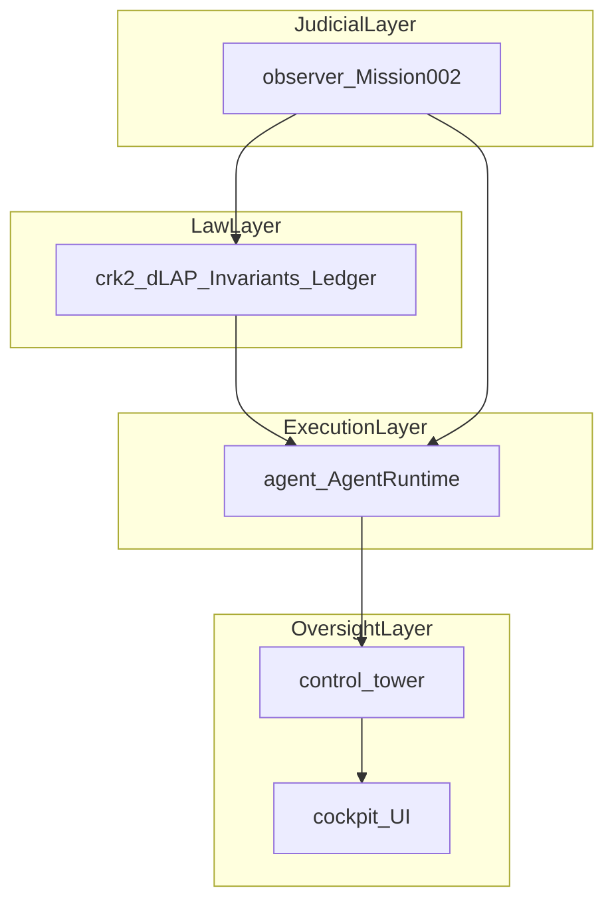

# Nova: The Constitutional Agentic Coding System

**Repository:** [warheart1984-ctrl/agentic-coding-agent](https://github.com/warheart1984-ctrl/agentic-coding-agent)

[](LICENSE)
[](MISSION-002.md)
[](docs/CRK-2-SPEC.md)

Nova is a **governed agentic coding system** built on the **Constitutional Runtime Kernel (CRK-2)** — a lawful substrate for autonomous reasoning, execution, and verification.

Every action is lawful.
Every change is accountable.
Every outcome serves the Constitution.

---

## Overview

Nova wraps agentic coding in a constitutional loop: plans and executions pass through **dLAP** legality checks, **invariant** enforcement, **continuity** preservation, and an immutable **ledger** before they touch your codebase.

| Layer | What it does |
|-------|----------------|
| **CRK-2** | Kernel — legality, invariants, continuity, ledger |
| **Nova SDK** (`agent/`) | `AgentRuntime` — plan, validate, execute, receipt |
| **Control Tower** | Multi-agent orchestration, consensus, drift detection |
| **Cockpit** | Operator flight deck — receipts, invariants, continuity matrix |

Mission **#002** ships a founder-independent reproduction bundle so any observer can rebuild, run, and verify the runtime without privileged access.

### Constitutional layers

Nova separates **law**, **execution**, **oversight**, and **verification** so governance cannot be bypassed by accident or convenience.

| Layer | Path | Role |
|-------|------|------|
| **Law** | `crk2/` | Invariants, constraints, receipts, continuity substrate, ledger — defines what is lawful |
| **Execution** | `agent/` | `AgentRuntime` — plans and executes under CRK-2; applies governance, never defines it |
| **Oversight** | `control-tower/` | Multi-agent orchestration, consensus, drift detection |
| **Judicial** | `observer/` | Founder-independent reproduction and drift-free verification |

This mirrors the constitutional stack: **Reality → Evidence → Judgment → Stewardship → Continuity**. See [`docs/WHAT-MY-AGENTIC-CODING-AGENT-DOES.md`](docs/WHAT-MY-AGENTIC-CODING-AGENT-DOES.md) for the full layered diagram.



> **Roadmap:** `packages/` (crk2, nova-sdk, control-tower, types), `apps/` (cockpit, shell, backend), and `missions/mission-002/` will formalize this layout as the monorepo grows. Today, paths above are at repository root for Mission #002.

---

## The Constitutional Runtime (CRK-2)

CRK-2 is the **lawful substrate** that governs all agentic behavior in this repository.

| Component | Role |
|-----------|------|
| **Lawful Action Predicate (dLAP)** | Determines legality of actions before execution |
| **Invariant Engine** | Maintains constitutional invariants at runtime |
| **Constraint Engine** | Enforces boundaries on plans and tool use |
| **Continuity Substrate v2** | Preserves identity, state, and replayable snapshots |
| **Ledger v2** | Hash-chained immutable audit trail |
| **Constitutional Amendments v2 (CA-2)** | Lawful evolution of the rule set |

CRK-2 is the kernel of **truth**, **continuity**, and **accountability**.

→ Full spec: [`docs/CRK-2-SPEC.md`](docs/CRK-2-SPEC.md)

---

## The Agentic SDK

The **Nova SDK** (`agent/`) exposes constitutional primitives for building governed agents.

```typescript
import { AgentRuntime, governance } from "./agent";
import { invariants } from "./config/nova.config";

for (const inv of invariants) {
  await governance.requireInvariant(inv);
}

const runtime = new AgentRuntime();

// Governed execution — validate → receipt → ledger.append
const result = await runtime.generateCode({
  prompt: "Add pagination to the API",
});

console.log(result.code);
console.log(result.receipts[0].ledgerHash);
```

Agents operate under CRK-2 governance — every plan, execution, and output is **verifiable**.

```bash
npx nova plan "Refactor the data access layer"
npx nova generate "Write a factorial function in TypeScript."
npx nova receipts
npx nova continuity
```

---

## Mission #002: Founder-Independent Reproduction

Mission #002 proves that Nova's governed runtime can be **reproduced and verified independently**.

| Goal | Rebuild the system from the observer bundle and confirm drift-free behavior |
|------|-------------------------------------------------------------------------------|

**Includes**

| Path | Contents |
|------|----------|
| [`observer/`](observer/) | Verification tools, checklist, expected output |
| [`docs/`](docs/) | Architecture, CRK-2 spec, operator certification |
| [`observer-bundle-mission-002.zip`](observer-bundle-mission-002.zip) | Immutable reference bundle |

**Verification steps**

1. Prepare a clean machine (Node.js 18+, Git)
2. Clone, `npm install`, `npm run build`
3. Rebuild CRK-2 and Nova SDK artifacts
4. Run the agent (`npx nova …` or `AgentRuntime`)
5. Verify receipts, ledger entries, and PIT transitions
6. Sign off via [`observer/CHECKLIST.md`](observer/CHECKLIST.md)

→ Protocol: [`observer/REPRO_PROTOCOL.md`](observer/REPRO_PROTOCOL.md) · Brief: [`MISSION-002.md`](MISSION-002.md)

**Bundle attestation**

| Property | Value |
|----------|-------|
| File | `observer-bundle-mission-002.zip` |
| SHA-256 | `5FFDF5B95095E9FA2C4331EE71739850C335D3F0FF7EBBC3F0E3C1BAB020BD82` |

---

## Quick Start

```bash
git clone https://github.com/warheart1984-ctrl/agentic-coding-agent.git
cd agentic-coding-agent
npm install
npm run build
```

**Cockpit (operator UI)**

```bash
npm run cockpit
```

Opens the React flight deck at `http://localhost:5173`.

---

## Project Structure

```
agentic-coding-agent/
├── agent/                 # Nova Agent SDK (AgentRuntime + governance)
├── crk2/                  # Constitutional Runtime Kernel v2
├── control-tower/         # Multi-agent orchestration
├── backend/               # Service layer + WebSocket events gateway
├── cockpit/               # Operator UI (NovaShell + Flight Deck)
├── observer/              # Mission #002 verification protocol
├── config/                # Mission invariants (nova.config.ts)
├── docs/                  # Architecture & specs
├── examples/              # Governed project templates
├── tools/fuzz/            # Kernel fuzz harness
└── shell/                 # Lawful Nova dev shell (bootstrap; separate concern)
```

> `shell/` is the self-bootstrapping Nova dev environment (macOS / Linux / Windows). It is intentionally separate from Mission #002 runtime code. See [`shell/README.md`](shell/README.md).

---

## For Developers

Build governed agents using the Nova SDK and CRK-2 kernel primitives.

| Resource | Link |
|----------|------|
| Architecture | [`docs/ARCHITECTURE.md`](docs/ARCHITECTURE.md) |
| CRK-2 spec | [`docs/CRK-2-SPEC.md`](docs/CRK-2-SPEC.md) |
| Control Tower | [`docs/NOVA-CONTROL-TOWER.md`](docs/NOVA-CONTROL-TOWER.md) |
| SDK entry | [`agent/runtime/agent-runtime.ts`](agent/runtime/agent-runtime.ts) |

**Primary API**

```typescript
const runtime = new AgentRuntime();

await runtime.validate(action);
await runtime.receipt(action, invIds);
runtime.ledger.append(receipt);
runtime.ledger.tailHash();
```

---

## For Verifiers

Use Mission #002 to independently reproduce and validate the runtime.

1. Verify bundle hash (see table above)
2. Follow [`observer/REPRO_PROTOCOL.md`](observer/REPRO_PROTOCOL.md)
3. Compare output to [`observer/EXPECTED_OUTPUT.md`](observer/EXPECTED_OUTPUT.md)
4. Complete [`observer/CHECKLIST.md`](observer/CHECKLIST.md)

Release notes and attestation: [`RELEASE.md`](RELEASE.md)

---

## Architecture overview

| Concern | Document |
|---------|----------|
| System layers and data flow | [`docs/ARCHITECTURE.md`](docs/ARCHITECTURE.md) |
| CRK-2 dual-stack (CRK-1 → CRK-2) | [`docs/CRK-2-SPEC.md`](docs/CRK-2-SPEC.md) · [`docs/CRK-1-TO-CRK-2-MIGRATION-PLAN.md`](docs/CRK-1-TO-CRK-2-MIGRATION-PLAN.md) |
| Figma-ready layer diagram | [`docs/WHAT-MY-AGENTIC-CODING-AGENT-DOES.md`](docs/WHAT-MY-AGENTIC-CODING-AGENT-DOES.md) |
| SDK and governance API | [`docs/api/governance.md`](docs/api/governance.md) · [`docs/api/nova.md`](docs/api/nova.md) |
| Mission #002 reproduction | [`MISSION-002.md`](MISSION-002.md) · [`observer/REPRO_PROTOCOL.md`](observer/REPRO_PROTOCOL.md) |

---

## Documentation

| Doc | Purpose |
|-----|---------|
| [MISSION-002.md](MISSION-002.md) | Mission brief + reproduction protocol |
| [docs/ARCHITECTURE.md](docs/ARCHITECTURE.md) | Constitutional runtime architecture |
| [docs/CRK-2-SPEC.md](docs/CRK-2-SPEC.md) | CRK-2 kernel specification |
| [docs/NOVA-CONTROL-TOWER.md](docs/NOVA-CONTROL-TOWER.md) | Multi-agent orchestration |
| [docs/index.md](docs/index.md) | Documentation hub |

---

## Core Principle

**Lawfulness. Accountability. Continuity.**

Nova transforms ideas into infrastructure — one invariant at a time.

---

## License

MIT © 2026
