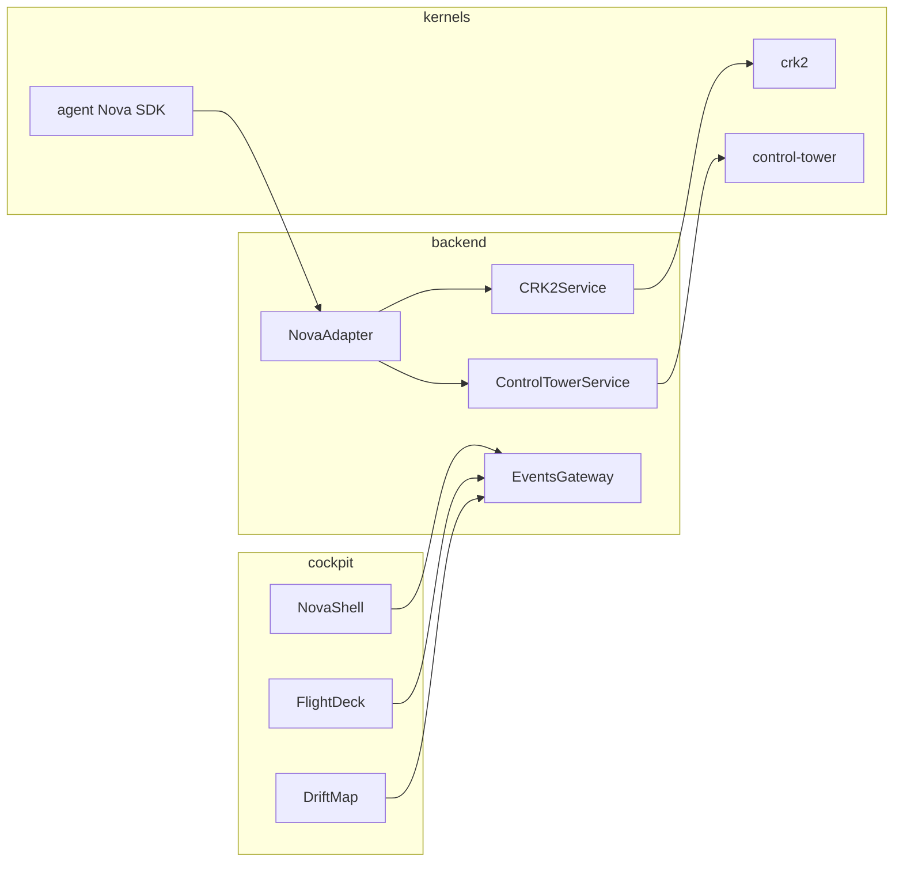

# Nova Mission #002 — Architecture

**Version:** 1.0  
**Purpose:** CRK-2 kernel, Control Tower orchestration, and unified cockpit (NovaShell).

---

## Layout

```
agentic-coding-agent/
  agent/            # Nova Agent SDK (AgentRuntime + governance)
  crk2/             # CRK-2 constitutional kernel (dLAP, PIT, MACC, ledger v2)
  control-tower/    # Multi-agent orchestration, replay, drift simulation
  backend/          # Service layer + events gateway (single API surface for UI)
  cockpit/          # React frontend (= NovaShell + Flight Deck + Drift Map)
  docs/             # Specs, operator certification, integrity suites
  tools/fuzz/       # Kernel fuzz harness
```

`cockpit/` is the **frontend** referenced in the nine-step integration plan.

---

## Data Flow



---

## Cockpit State Model

| Store | Responsibility |
|-------|----------------|
| `store.ts` | Single-agent HUD: plans, receipts, violations, continuity |
| `kernelStore.ts` | CRK-2 version, PIT band, continuity anchor |
| `clusterStore.ts` | Agents, cluster events, replay window |
| `driftStore.ts` | Per-agent snapshot grid, divergence events |

`WebSocketBridge.ts` connects to `ws://127.0.0.1:8787/events` when available; otherwise syncs from in-process Nova events.

---

## Center Modes

| Mode | Component |
|------|-----------|
| Plan / Diff / Receipts / Invariants / Kernel | Existing panels (CRK-2-aware via stores) |
| Continuity | Timeline + Continuity Matrix |
| Flight Deck | `FlightDeckShell` |
| Drift Map | `DriftVisualizer` |

---

## Nine-Step Integration Status

| Step | Status |
|------|--------|
| 01 Repo layout (crk2, control-tower, cockpit) | Done |
| 02 Backend surface (crk2-service, control-tower-service, events-gateway) | Done |
| 03 Zustand stores (kernel, cluster, drift) | Done |
| 04 WebSocket bridge | Done (with in-process fallback) |
| 05 NovaShell + Flight Deck + Drift modes | Done |
| 06 Cluster replay in BottomBand | Partial (replay window UI; API wired in control-tower) |
| 07 CRK-2-aware panels | Partial (stores wired; panel annotations incremental) |
| 08 nova-adapter (governance by construction) | Done (backend/nova-adapter.ts) |
| 09 Tests + docs | Docs done; tests incremental |

---

## Related

- [CRK-2 Spec](./CRK-2-SPEC.md)
- [Control Tower](./NOVA-CONTROL-TOWER.md)
- [Flight Deck React](./operator/NOVA-FLIGHT-DECK-REACT.md)
- [Operator Certification](./operator/index.md)
