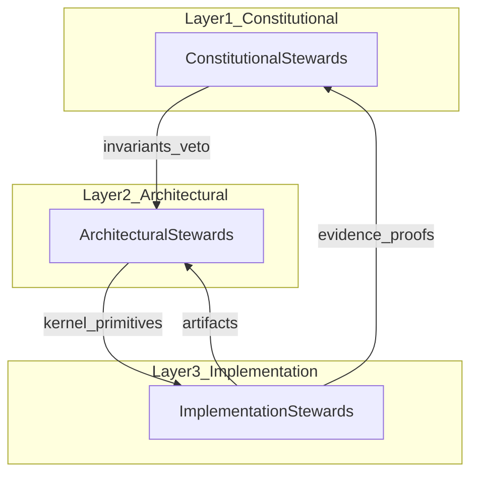

# AAES-OS Network-Wide Stewardship Map

**Status:** Governance Reference
**Version:** 0.1

This map defines roles, flows, and authorities across the entire AAES-OS network.

---

## Overview

AAES-OS stewardship is organized in three layers. Authority flows downward (constraints); evidence flows upward (validation). Governance veto closes the loop.

---

## Layer 1 — Constitutional Stewards

**Authority:** Invariants

| Steward | Domain |
|---------|--------|
| **Wendy** | Emotional Governance |
| **Sue** | Human Readiness Architecture |
| **Nishant** | Reconstruction & Continuity Accountability |
| **Frank** | Legitimacy & Admissibility |
| **Maher** | Political Economy & Decision Architecture |

### Powers

- Ratify invariants
- Approve or veto kernel changes
- Validate continuity claims
- Maintain legitimacy

### Flow

They define **what must be true**.

---

## Layer 2 — Architectural Stewards

**Authority:** Kernel

| Steward | Domain |
|---------|--------|
| **You** | Kernel Architect, Continuity Runtime |
| **William J. Storey** | Enterprise AI Architecture |
| **Nirvisha** | Type Systems & Developer Guardrails |
| **Nitesh** | Deterministic Runtime & Validation |

### Powers

- Freeze CRK-1 (and successor kernels)
- Maintain deterministic execution
- Define runtime primitives
- Produce proofs

### Flow

They define **how the system behaves**.

---

## Layer 3 — Implementation Stewards

**Authority:** Execution

| Steward | Domain |
|---------|--------|
| **Shakeel** | Implementation |
| **Abdullah** | Implementation |
| **Dhaval** | Implementation |
| **Ravi** | Implementation |
| **Deep** | Implementation |
| **Sachin** | Implementation |
| **Emmanuel** | Implementation |
| **Aun** | Implementation |
| **Mike** | Implementation |

### Powers

- Build SDKs, APIs, and production systems
- Maintain infrastructure
- Integrate runtime with real-world systems

### Flow

They define **how the system is used**.

---

## Cross-Layer Flows

### Governance → Architecture

| Mechanism | Effect |
|-----------|--------|
| Invariants | Constrain kernel behavior |
| Veto power | Prevent unsafe changes |

### Architecture → Implementation

| Mechanism | Effect |
|-----------|--------|
| Kernel primitives | Define lawful operations |
| SDKs and APIs | Express primitives to developers |

### Implementation → Governance

| Mechanism | Effect |
|-----------|--------|
| Evidence upward | Artifacts, receipts, proofs |
| Validation | Continuity and legitimacy checks |

This is a **closed, corrigible loop**.

---

## Authority Matrix

| Action | Constitutional | Architectural | Implementation |
|--------|:--------------:|:-------------:|:--------------:|
| Ratify K-∞ | ✓ | consult | — |
| Freeze kernel | veto | ✓ | — |
| Ship SDK/API | consult | approve | ✓ |
| Validate CDP-1 | ✓ | support | execute |
| Veto runtime change | ✓ | — | — |

---

## Related Documents

| Document | Path |
|----------|------|
| AAES-OS Constitution v0.1 | [`../constitution/AAES_OS_CONSTITUTION_v0.1.md`](../constitution/AAES_OS_CONSTITUTION_v0.1.md) |
| Activation Ceremony | [`../activation/AAES_OS_ACTIVATION_CEREMONY.md`](../activation/AAES_OS_ACTIVATION_CEREMONY.md) |
| First-Wave Onboarding | [`../onboarding/FIRST_WAVE_ONBOARDING_PROTOCOL.md`](../onboarding/FIRST_WAVE_ONBOARDING_PROTOCOL.md) |
